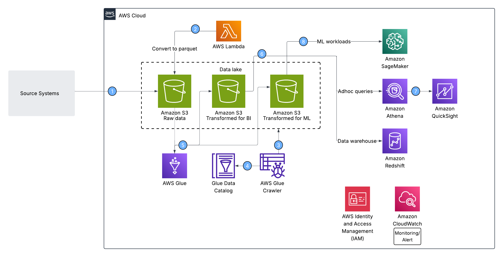
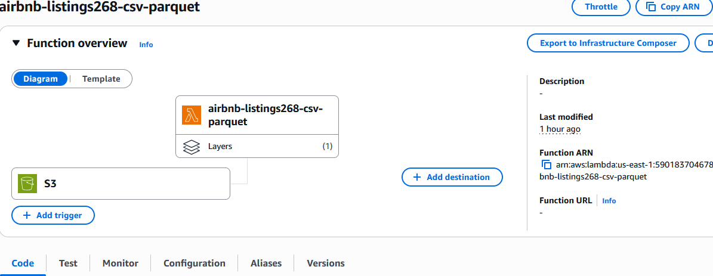
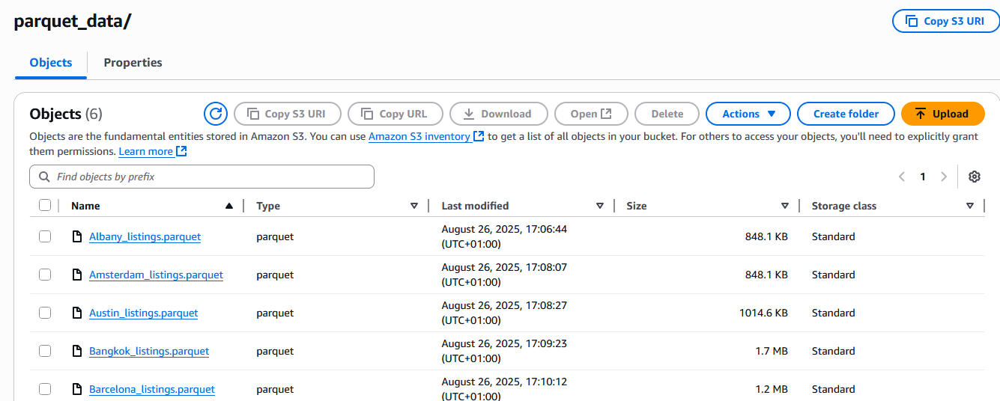
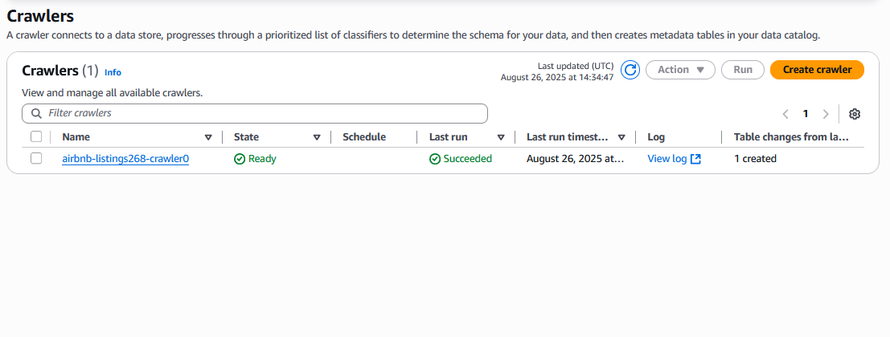
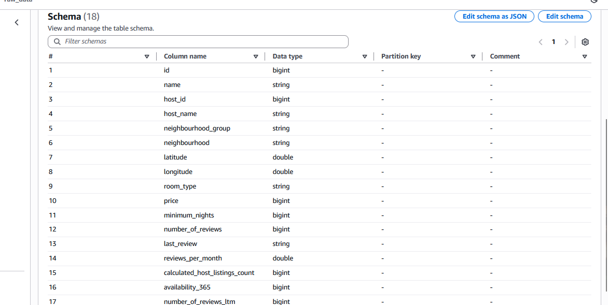
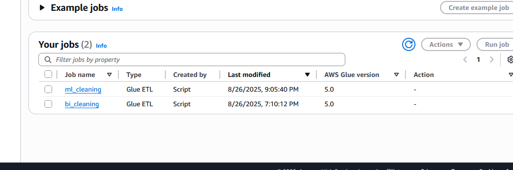
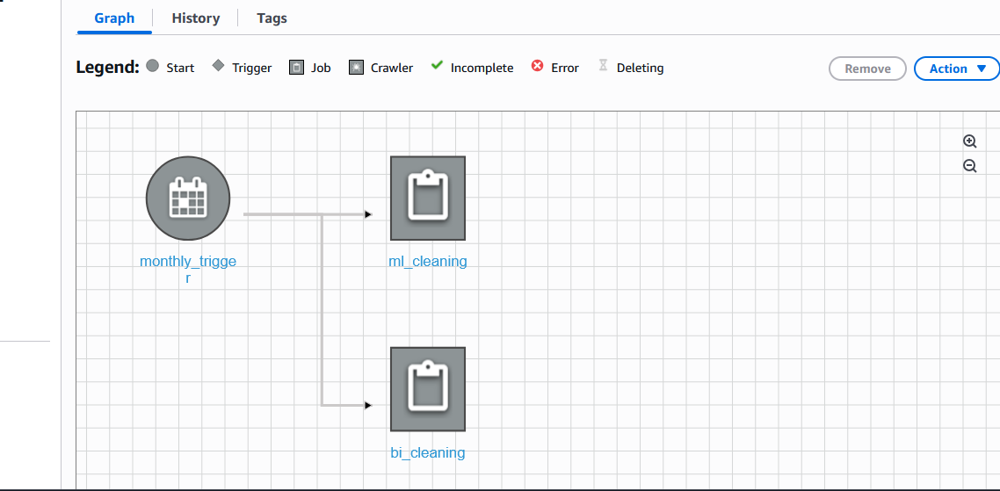
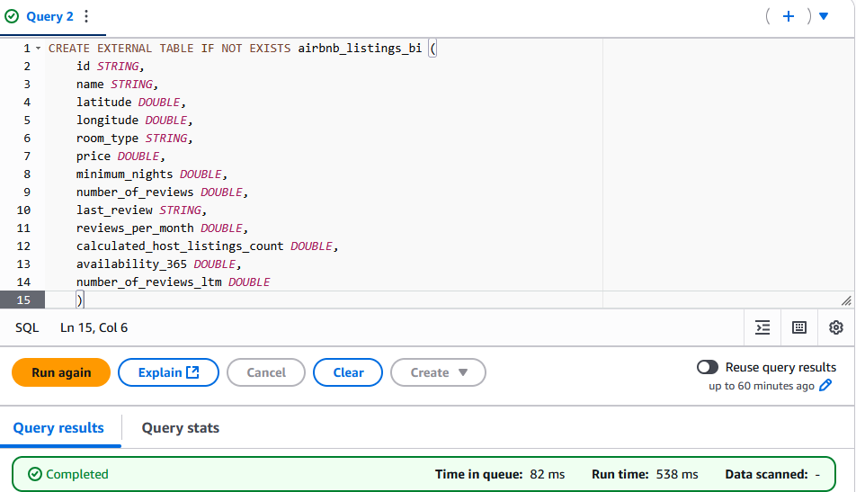
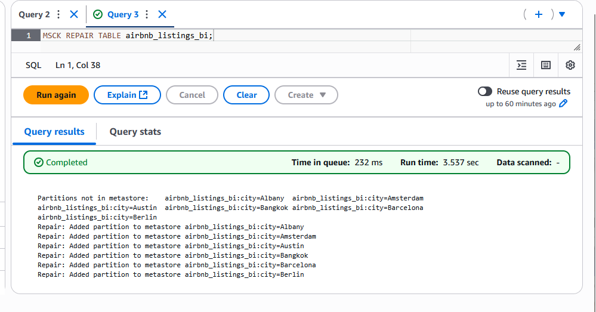
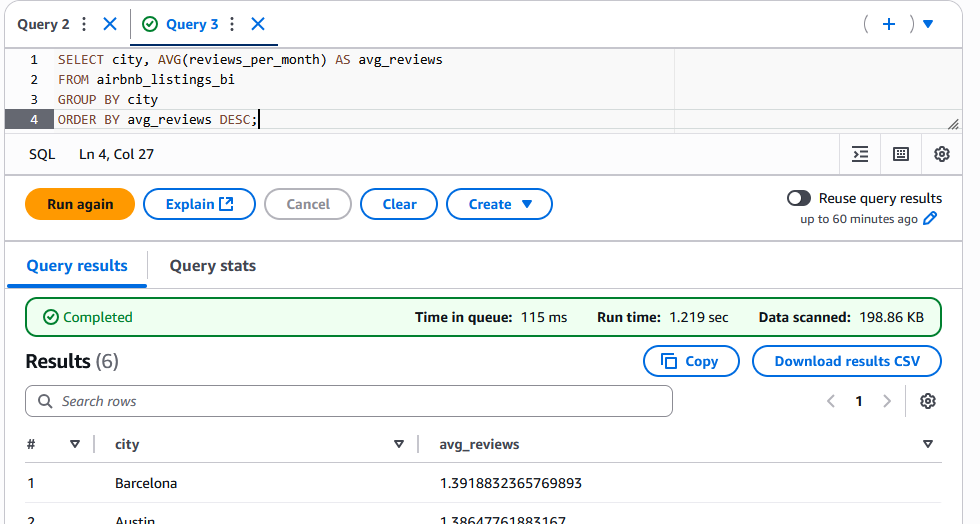

# Mini data platform on AWS

I built this project to serve as a reference for enterprises or individuals who want to design and deploy a modern data platform on AWS Cloud. It can be helpful whether you are migrating from a legacy system or starting from scratch to build a scalable data infrastructure.

For simplicity, I used the open dataset from **Airbnb** (available at [Inside Airbnb](https://insideairbnb.com/get-the-data)).

## Architecture

The following diagram summarizes the overall data platform architecture:




The workflow begins by uploading enterprise raw data into an Amazon S3 bucket (raw_data). Once a file is uploaded, an AWS Lambda function is triggered automatically to convert the file into Parquet format for optimized storage and querying.






Next, an AWS Glue Crawler scans the S3 buckets and builds the AWS Glue Data Catalog, which acts as the metadata layer of the platform.





Two AWS Glue Jobs handle data transformation:

- bi_cleaning: Prepares data for analytics and BI use cases.
- ml_cleaning: Prepares data for ML/forecasting workloads.



These jobs are orchestrated via an AWS Glue Workflow that executes them on a monthly schedule.




## Querying with Athena

A table is created in Amazon Athena to run ad-hoc queries on the transformed data.



The table is populated using the following command:


```sql
MSCK REPAIR TABLE airbnb_listings_bi;
```




Example query:

```sql
SELECT city, AVG(reviews_per_month) AS avg_reviews
FROM airbnb_listings_bi
GROUP BY city
ORDER BY avg_reviews DESC;
```




## Downstream analytics and ML

- Cleaned data for BI (transformed_bi) can be queried via Athena, loaded into Amazon Redshift as a data warehouse, and visualized with Amazon QuickSight dashboards.

- Cleaned data for ML (transformed_ml) is used to train forecasting models in Amazon SageMaker.

## Supporting services

- AWS IAM: Manages secure access to AWS services, ensuring proper roles and permissions.

- Amazon CloudWatch: Provides monitoring, logging, and alerting for the pipeline and infrastructure.

## Conclusion

This project demonstrates how to build a mini data platform on AWS using open Airbnb datasets. The system covers the full lifecycle from raw data ingestion into an S3-based data lake, transformation pipelines with Glue, query capabilities with Athena, downstream analytics in Redshift/QuickSight, and machine learning workloads in SageMaker.

It can be expanded for enterprise-scale needs with additional automation, monitoring, and CI/CD pipelines.